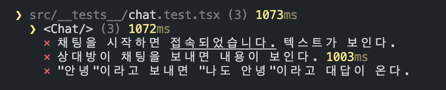
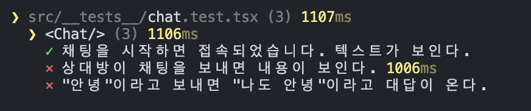
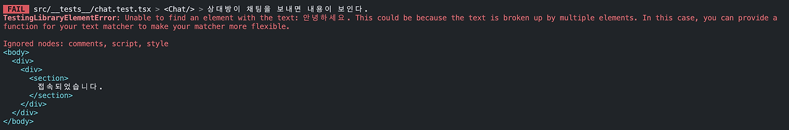
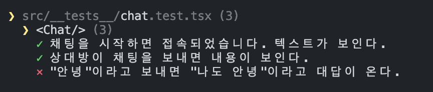
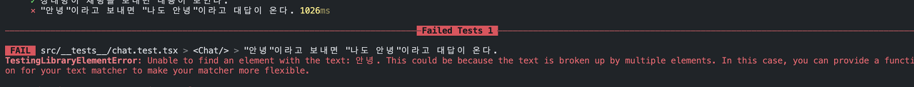
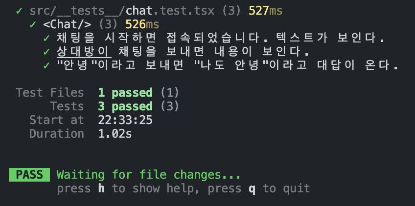

# SocketIO를 활용한 리액트 실시간통신 테스팅

## 들어가기 전에
컴포넌트 **단위 테스트**를 작성할 때의 주요 관심사가 무엇일까요? 서버나 외부에서 데이터가 정상적으로 전달되었다는 것을 가정하고, UI가 의도대로 렌더링되는가에 관심을 둡니다.

그런데 통합테스트 단계에서는 그러한 데이터가 전달되는 상황을 Mocking 해야할 필요가 있습니다. 그래서 [msw](https://mswjs.io/)와 같은 라이브러리를 활용하여 하여 테스트를 서버로부터 오는 단방향 통신에 대해 Mocking 하여 통합테스트를 마무리할 수 있게 됩니다.

그러나 msw에서는 WebSocket과 같은 양방향 통신에 대한 지원이 존재하지 않아 채팅과 같은 실시간서비스의 통합테스팅을 작성하는데는 적합하지 않습니다. 따라서 Socket.IO가 제공하는 테스팅 예제를 활용하여 서버와의 양방향 통신을 Mocking 할 수 있는 방법을 공유해보겠습니다.

### 선수지식
이 글에서 사용하는 기술들에 대한 상세한 사용법에 대해서는 설명하지 않습니다.
- React
- Socket.IO
- Vitest, testing-library

:::warning
이 포스트에서 제공하는 방식은 실시간 통신을 Socket.IO 라이브러리를 활용하는 경우로 한정하여 작동합니다.  
[Socket.IO 예제보기](https://socket.io/docs/v4/testing/)
:::

예시로 아주 간단한 채팅서비스를 만들어보겠습니다. 단위테스트는 생략하고 통합테스트 작성 후 컴포넌트 구현까지 진행해보겠습니다. 기능은 다음과 같습니다.
1. 상대방이 채팅을 보내면 내가 확인 할 수 있다.
2. 내가 채팅을 보내면 상대방이 답장을 해준다.

---

## 테스트 케이스
간단한 채팅서비스 답게 케이스도 매우 간단합니다.
```tsx
describe('<Chat/>', () => {
  test('채팅을 시작하면 접속되었습니다. 텍스트가 보인다.', () => {})

  test('상대방이 채팅을 보내면 내용이 보인다.', () => {})

  test('"안녕"이라고 보내면 "나도 안녕"이라고 대답이 온다.', () => {})
})
```

---

## 테스트 코드

### 1. UI 테스트
Socket 통신에 대한 테스트코드는 제외하고 우선 UI에 대해 테스트 코드를 아래와 같이 작성합니다. 미리 예상해서 작성해둔 테스트 코드이기 때문에 개발이 진행되면서 구현 내용이 계속 발전될 예정입니다.

```tsx
import { fireEvent, render } from '@testing-library/react'
import Chat from './chat'

describe('<Chat/>', () => {
  test('채팅을 시작하면 접속되었습니다. 텍스트가 보인다.', async () => {
    const { getByText, findByText } = renderChat(fakeUrl)

    const beforeConnect = getByText('접속중입니다.')
    expect(beforeConnect).toBeInTheDocument()

    const connectTest = await findByText('접속되었습니다.')
    expect(connectTest).toBeInTheDocument()
  })

  test('상대방이 채팅을 보내면 내용이 보인다.', async () => {
    const { findByText } = render(<Chat />)

    // TODO: 상대방이 채팅을 보내는 상황 Mocking

    const chatBySomeone = await findByText('안녕하세요')

    expect(chatBySomeone).toBeInTheDocument()
  })

  test('"안녕"이라고 보내면 "나도 안녕"이라고 대답이 온다.', async () => {
    const { getByPlaceholderText, getByRole, findByText } = render(<Chat />)

    const input = getByPlaceholderText('텍스트를 입력하세요')
    fireEvent.change(input, { target: { value: '안녕' } })

    const button = getByRole('button')
    fireEvent.click(button)

    const chatByMe = await findByText('안녕')
    expect(chatByMe).toBeInTheDocument()

    const chatBySomeone = await findByText('나도 안녕')
    expect(chatBySomeone).toBeInTheDocument()
  })
})
```

### 2. Socket Mocking
> 공식문서에 있는 방법으로 구현하였습니다. 

```tsx
import { fireEvent, render } from '@testing-library/react'
import Chat from './chat'
import { io as ioc, type Socket as ClientSocket } from 'socket.io-client'
import { Server, type Socket as ServerSocket } from 'socket.io'
import { createServer } from 'http'
import { AddressInfo } from 'net'
import { SOCKET_EVENTS } from './mocks/ChatSocket'

describe('<Chat/>', () => {
  /**
   * Mock Socket
   */
  let io: Server,
    serverSocket: ServerSocket,
    clientSocket: ClientSocket,
    fakeUrl: string

  beforeAll(() => {
    return new Promise<void>((resolve) => {
      const httpServer = createServer()
      io = new Server(httpServer)

      httpServer.listen(() => {
        const port = (httpServer.address() as AddressInfo).port
        fakeUrl = `http://localhost:${port}`
        clientSocket = ioc(fakeUrl)

        // 클라이언트에서 연결을 시도하면 서버소켓이 변수에 할당된다.
        io.on(SOCKET_EVENTS.CONNECT, (socket) => {
            serverSocket = socket
        })

        // 소켓인 연결되면 beforeAll을 마친다.
        clientSocket.on(SOCKET_EVENTS.CONNECT, resolve)
      })
    })
  })
  
  afterAll(() => {
    io.close()
    clientSocket.disconnect()
  })

	///... 나머지 테스트 코드들 ...///
})

```

### 3. 테스트 환경에서 fakeUrl로 Socket 연결하기
`ServerSocket`을 Mocking하면서 `fakeUrl`을 얻을 수 있었는데요. `<Chat/>`내부에서는 `ServerSocket`에 연결하기 위한 URL이 필요할겁니다. 실서비스에서는 실제 URL을 사용하고 현재 테스트 환경에서는 `fakeUrl`로 대체하여 사용하면 되겠습니다. 다음에 따라 테스트 코드를 수정합니다.

1. 컴포넌트가 `ServerSocket` 연결을 위한 주소를 할당받도록 수정
2. 각 테스트에서 사용할 renderer인 `renderChat`를 만들기
3. 각 테스트케이스에 적용

```tsx
import { fireEvent, render } from '@testing-library/react'
import Chat from './chat'
import { io as ioc, type Socket as ClientSocket } from 'socket.io-client'
import { Server, type Socket as ServerSocket } from 'socket.io'
import { createServer } from 'http'
import { AddressInfo } from 'net'
import { SOCKET_EVENTS } from './mocks/ChatSocket'

/**
 * Chat 컴포넌트 renderer
 */
const renderChat = (socketUrl: string) => {
    return render(<Chat socketUrl={socketUrl} />)
}

describe('<Chat/>', () => {
  /**
   * Mock Socket
   */
  let io: Server,
    serverSocket: ServerSocket,
    clientSocket: ClientSocket,
    fakeUrl: string

  beforeAll(() => {
    return new Promise<void>((resolve) => {
      const httpServer = createServer()
      io = new Server(httpServer)

      httpServer.listen(() => {
        const port = (httpServer.address() as AddressInfo).port
        fakeUrl = `http://localhost:${port}`
        clientSocket = ioc(fakeUrl)

        // 클라이언트에서 연결을 시도하면 서버소켓이 변수에 할당된다.
        io.on(SOCKET_EVENTS.CONNECT, (socket) => {
            serverSocket = socket
        })

        // 소켓인 연결되면 beforeAll을 마친다.
        clientSocket.on(SOCKET_EVENTS.CONNECT, resolve)
      })
    })
  })
  
  afterAll(() => {
    io.close()
    clientSocket.disconnect()
  })

  test('채팅을 시작하면 접속되었습니다. 텍스트가 보인다.', async () => {
    // 렌더러를 적용하고 fakeUrl 전달
    const { getByText, findByText } = renderChat(fakeUrl)

    const beforeConnect = getByText('접속중입니다.')
    expect(beforeConnect).toBeInTheDocument()

    const connectTest = await findByText('접속되었습니다.')
    expect(connectTest).toBeInTheDocument()
  })

  test('상대방이 채팅을 보내면 내용이 보인다.', async () => {
    // 렌더러를 적용하고 fakeUrl 전달
    const { findByText } = renderChat(fakeUrl)

    // 상대방이 채팅을 보내는 상황 Mocking

    const chatBySomeone = await findByText('안녕하세요')

    expect(chatBySomeone).toBeInTheDocument()
  })

  test('"안녕"이라고 보내면 "나도 안녕"이라고 대답이 온다.', async () => {
    // 렌더러를 적용하고 fakeUrl 전달
    const { getByPlaceholderText, getByRole, findByText } =
        renderChat(fakeUrl)

    const input = getByPlaceholderText('텍스트를 입력하세요')
    fireEvent.change(input, { target: { value: '안녕' } })

    const button = getByRole('button')
    fireEvent.click(button)

    const chatByMe = await findByText('안녕')
    expect(chatByMe).toBeInTheDocument()

    const chatBySomeone = await findByText('나도 안녕')
    expect(chatBySomeone).toBeInTheDocument()
  })
})
```

### 4. 실패하는 테스트 확인
테스트들이 모두 실패하였습니다. 이제 테스트를 통과할 수 있도록 `<Chat/>` 컴포넌트를 구현하겠습니다.



---

## 첫번째 케이스
*채팅을 시작하면 "접속되었습니다." 텍스트가 보인다.*

```tsx title="Chat Component"
import { useEffect, useState } from 'react'
import { io } from 'socket.io-client'
import { SOCKET_EVENTS } from './mocks/ChatSocket'

interface ChatProps {
    socketUrl: string
}

export default function Chat({ socketUrl }: ChatProps) {
  // Connect Flag
  const [isConnected, setIsConnected] = useState(false)

  // Socket Client
  const [socket] = useState(
    io(socketUrl, { autoConnect: false })
  )

  useEffect(() => {
    socket.connect()

    // 소켓이 연결되었을 때
    socket.on(SOCKET_EVENTS.CONNECT, () => {
      setIsConnected(true)
    })

    // 소켓 연결이 끊겼을 때
    socket.on(SOCKET_EVENTS.DISCONNECT, () => {
      setIsConnected(false)
    })

    return () => {
      socket.disconnect()
    }
  }, [])

  return (
    <div>
      <section>
        {isConnected ? '접속되었습니다.' : '접속중입니다.'}
      </section>
    </div>
  )
}
```

### 테스트 결과
모든 기능이 구현된 것은 아니지만, 첫번째 테스트케이스를 통과하는 `<Chat/>` 컴포넌트로 구현이 완료되었습니다. 같은 방법으로 두번째, 세번째 케이스도 통과하도록 구현하면 원하는 채팅서비스가 완성될 것입니다.



---

## 두번째 케이스
*상대방이 채팅을 보내면 내용이 보인다.*

```tsx title="Chat Component"
import { useEffect, useState } from 'react'
import { io } from 'socket.io-client'
import { SOCKET_EVENTS } from './mocks/ChatSocket'

interface ChatProps {
    socketUrl: string
}

export default function Chat({ socketUrl }: ChatProps) {
  // Connect Flag
  const [isConnected, setIsConnected] = useState(false)
  // Chatting
  const [chatting, setChatting] = useState<string[]>([])

  // Socket Client
  const [socket] = useState(
    io(socketUrl, { autoConnect: false })
  )

  useEffect(() => {
    socket.connect()

    // 소켓이 연결되었을 때
    socket.on(SOCKET_EVENTS.CONNECT, () => {
      setIsConnected(true)
    })

    // 소켓 연결이 끊겼을 때
    socket.on(SOCKET_EVENTS.DISCONNECT, () => {
      setIsConnected(false)
    })

    // 채팅 메시지가 도착했을 때
    socket.on(
      SOCKET_EVENTS.SEND_MESSAGE,
      (status: string, message: string) => {
        if (status === 'SUCCESS') {
            setChatting((prev) => [...prev, message])
        }
      },
    )

    return () => {
      socket.disconnect()
    }
  }, [])

  return (
    <div>
      <section>
        {isConnected ? '접속되었습니다.' : '접속중입니다.'}
      </section>

      {/* 채팅메시지 */}
      {chatting.map((chat) => (
        <p>{chat}</p>
      ))}
    </div>
  )
}
```

### 테스트 결과
실패하였습니다. 에러 내용으로는 "안녕하세요"라는 채팅메시지를 찾을 수 없었다는 것인데요. 아마 "안녕하세요" 메시지가 오지 않아서 인 것 같습니다.



### 테스트 통과시키기
테스트케이스 내용을 살펴보니, 상대방이 채팅을 보내는 상황에 대한 Mocking이 이루어지지 않았습니다. 메시지 자체가 오지 않아서 실패했다고 볼 수 있겠습니다. 그래서 Socket을 Mocking 하면서 얻었던 `serverSocket`을 이용하여 상대방이 저에게 메세지를 보낸 척 다음과 같이 Mocking 하겠습니다.

```tsx
  test('상대방이 채팅을 보내면 내용이 보인다.', async () => {
    const { findByText } = renderChat(fakeUrl)

    serverSocket.emit(SOCKET_EVENTS.SEND_MESSAGE, 'SUCCESS', '안녕하세요')

    const chatBySomeone = await findByText('안녕하세요')
    expect(chatBySomeone).toBeInTheDocument()
  })
```

그러나 이 상태로 테스트를 실행한다면 테스트는 다시 실패할 것입니다. 왜냐하면 테스트 상황 안에서 `<Chat/>`의 Socket이 연결이 완료된 후에 이벤트가 발생해야 정상적으로 '안녕하세요' 메시지를 받을 수 있기 때문입니다.

첫번째 케이스에서 '접속되었습니다.' 텍스트가 화면에 있으면 Socket 연결이 완료되었다는 것을 테스트 했었습니다. 따라서 두번째 케이스에서도 연결 완료된 타이밍을 해당 텍스트 검사를 통해 확인하고 나서 `serverSocket`의 이벤트를 발생시키면 되겠습니다.

```tsx
  test('상대방이 채팅을 보내면 내용이 보인다.', async () => {
    const { findByText } = renderChat(fakeUrl)

    // 소켓 연결되었는지 확인
    expect(await findByText('접속되었습니다.')).toBeInTheDocument()

    serverSocket.emit(SOCKET_EVENTS.SEND_MESSAGE, 'SUCCESS', '안녕하세요')

    const chatBySomeone = await findByText('안녕하세요')
    expect(chatBySomeone).toBeInTheDocument()
  })
```

이젠 두번째 케이스도 통과하는 `<Chat/>` 컴포넌트가 되었습니다.



---

## 세번째 케이스
*"안녕"이라고 보내면 "나도 안녕"이라고 대답이 온다.*

마지막 케이스에서는 직접 채팅메시지를 보내고, 거기에 맞는 답장까지 잘 받을 수 있는지 진짜 대화를 하는 것이 가능하도록 `<Chat/>` 컴포넌트를 완성시키겠습니다.

```tsx
import { ChangeEventHandler, useCallback, useEffect, useState } from 'react'
import { Socket, io } from 'socket.io-client'
import { SOCKET_EVENTS } from './mocks/ChatSocket'

interface ChatProps {
  socketUrl: string
}

export default function Chat({ socketUrl }: ChatProps) {
  // Connect Flag
  const [isConnected, setIsConnected] = useState(false)
  // Chatting
  const [chatting, setChatting] = useState<string[]>([])
  // Chat Message
  const [chat, setChat] = useState('')
  // Socket Client
  const [socket] = useState<Socket>(
    io(socketUrl, {
      autoConnect: false,
    }),
  )

  useEffect(() => {
    socket.connect()

    // 소켓이 연결되었을 때
    socket.on(SOCKET_EVENTS.CONNECT, () => {
      setIsConnected(true)
    })

    // 소켓 연결이 끊겼을 때
    socket.on(SOCKET_EVENTS.DISCONNECT, () => {
      setIsConnected(false)
    })

    // 채팅 메시지가 도착했을 때
    socket.on(
      SOCKET_EVENTS.SEND_MESSAGE,
      (status: string, message: string) => {
        if (status === 'SUCCESS') {
          setChatting((prev) => [...prev, message])
        }
      },
    )

    return () => {
      socket.disconnect()
    }
  }, [])

  const onChangeChat: ChangeEventHandler<HTMLInputElement> = useCallback(
    (e) => {
      setChat(e.target.value)
    },
    [setChat],
  )

  const onClickSend = useCallback(() => {
    setChatting((prev) => [...prev, chat])
    setChat('')

    socket?.emit(SOCKET_EVENTS.SEND_MESSAGE, chat)
  }, [socket, chat, setChatting, setChat])

  return (
    <div>
      <section>
          {isConnected ? '접속되었습니다.' : '접속중입니다.'}
      </section>

      {/* 채팅메시지 */}
      {chatting.map((chat, idx) => (
          <p key={idx}>{chat}</p>
      ))}

      <input placeholder='텍스트를 입력하세요' onChange={onChangeChat} />
      <button role='button' onClick={onClickSend}>
          보내기
      </button>
    </div>
  )
}
```

### 테스트 결과


역시 실패합니다. 이전 테스트케이스에서와 마찬가지로 채팅을 보내고 받는 부분에 대한 Mocking이 존재하지 않았기 때문입니다.

### 테스트 통과시키기
연결이 완료된 후에 `serverSocket`이 생성되기 때문에 새로운 이벤트 핸들러를 등록할 때도 마찬가지로 '접속되었습니다' 텍스트 확인 후에 해주도록 합니다. `serverSocket.on`에서 '안녕' 메시지를 받으면 '나도 안녕' 메시지를 답장으로 보내도록 Mocking합니다.

```tsx
  test('"안녕"이라고 보내면 "나도 안녕"이라고 대답이 온다.', async () => {
    const { getByPlaceholderText, getByRole, findByText } =
        renderChat(fakeUrl)

    expect(await findByText('접속되었습니다.')).toBeInTheDocument()

    serverSocket.on(SOCKET_EVENTS.SEND_MESSAGE, (message) => {
      if (message === '안녕') {
        serverSocket.emit(
          SOCKET_EVENTS.SEND_MESSAGE,
          'SUCCESS',
          '나도 안녕',
        )
      }
    })

    const input = getByPlaceholderText('텍스트를 입력하세요')
    fireEvent.change(input, { target: { value: '안녕' } })

    const button = getByRole('button')
    fireEvent.click(button)

    const received = await findByText('나도 안녕')
    expect(received).toBeInTheDocument()
  })
```

이젠 마지막 케이스까지 성공하는 결과를 얻을 수 있게 되었습니다.



---

## 정리
msw를 사용해서 서버응답을 Mocking 하는 것과 다르게 직접 테스트슈트 안에서 서버를 열고 요청과 응답을 컨트롤 해야해서 어려운 부분이 있었습니다. 하지만 Socket.IO에서 친절하게 예제로 제시해 준 것을 토대로 하면 어렵지 않게 진행할 수 있었습니다.

이 글에서 제시하는 Mocking 접근 방법에 대해 잘못된 부분이 있거나 보완 및 보충해주실 내용이 있다면 댓글로 남겨주세요 ☺️
