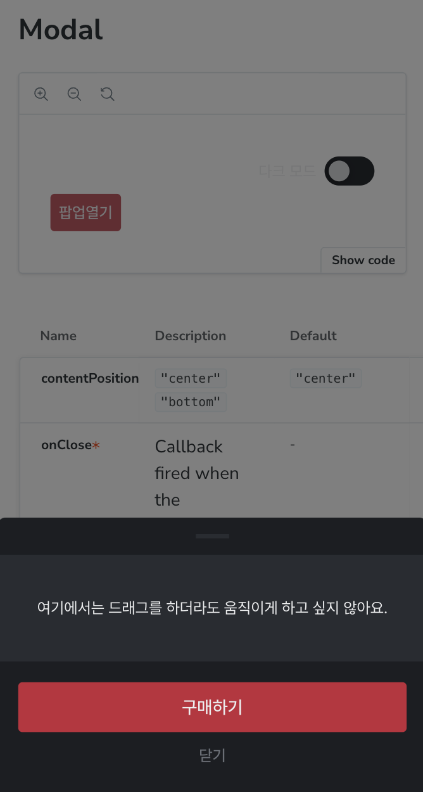

## 문제의 발견
모달을 제작시, 모달을 아래쪽으로 드래그하여 꺼질 수 있는 기능을 `framer-motion`을 사용하여 구현하였습니다.
애니메이션은 모두 정상적으로 잘 작동하였는데요, 문제를 하나 만나게 됩니다.

> 모달 안에 위아래로 드래그하여 시간을 선택하는 TimePicker를 배치해야했습니다.
> 그런데 TimePicker에서 시간을 선택하려고 **드래그 하는 순간 모달 전체가 움직여버립니다!**

따라서 TimePicker 영역에서 드래그를 시도할 경우, 그 이벤트가 모달 전체로 전파되는 것을 막아 각 영역에서 별도의 드래그가 가능하도록 처리하려는 아이디어로 접근하였습니다.
결론적으로 이벤트 전파를 막는 방식으로는 이 문제를 해결 수 없습니다.

왜냐하면 React가 관리하는 DOM과 framer-motion이 관리하는 DOM이 다르기 때문에 우리가 일반적으로 하는 `event.stopPropagation()`으로 이벤트 전파를 막을 수 없기 때문입니다.

---

<!--truncate-->

### 자식요소의 드래그로부터 부모요소의 애니메이션을 막는 방법

<div style={{ maxWidth: '450px', margin: '0 auto' }}>
  
</div>

우리가 하고 싶은 것은 "여기에서는 드래그를 하더라도 움직이게 하고 싶지 않아요." 영역에서 드래그를 시도할 때, 모달에서 어떤 애니메이션도 발생하지 않는 것입니다.
기존에 구현했던 코드를 통해 힌트를 얻을 수 있습니다.

 ```tsx
 /**
 * ModalDragger
 */
export interface ModalDraggerProps {
  children: ReactNode
  onClose: () => void
}
export function ModalDragger({ onClose, children }: ModalDraggerProps) {
  return (
    <motion.div
      drag={'y'}
      dragConstraints={{ top: 0, bottom: 0 }}
      onDragEnd={(_, info) => {
        const shouldClose = info.offset.y > 60
    
        if (shouldClose) {
          onClose()
        }
      }}
    >
      {children}
    </motion.div>
  )
}
```

`motion.div`의 `drag`는 `'y'` , `'x'` 또는 `false`를 받아 드래그의 방향을 정하거나 드래그를 막을 수 있습니다.

따라서 내부요소에서 드래그가 발생할 때 부모 드래그 컨테이너에서는 `false` 값을 가지고 있다면 애니메이션을 발생하지 않을 것입니다.

---

### 자식 요소의 드래그로부터 부모의 드래그 상태를 변경하기
여기에서 ContextAPI를 활용하여 자식요소가 부모의 드래그 상태를 변경할 수 있도록 하겠습니다.

1. 부모의 drag 상태를 관리하는 `Context`를 만듭니다.
2. 초기 값을 부모 내부의 `useState`를 통해 설정하고 Context로 전달합니다.

```tsx
/**
 * Drag State Context
 */
type BottomDragState = 'y' | false
interface BottomDragContextValue {
  state: BottomDragState
  setState: Dispatch<SetStateAction<BottomDragState>>
}
const BottomDragContext = createContext<BottomDragContextValue>({
  state: 'y',
  setState: () => {},
})


/**
 * ModalDragger
 */
export interface ModalDraggerProps {
  children: ReactNode
  onClose: () => void
}
export function ModalDragger({ onClose, children }: ModalDraggerProps) {
  const [dragState, setDragState] = useState<BottomDragState>('y')

  return (
    <motion.div
      drag={dragState}
      dragConstraints={{ top: 0, bottom: 0 }}
      onDragEnd={(_, info) => {
        const shouldClose = info.offset.y > 60
    
        if (shouldClose) {
          onClose()
        }
      }}
    >
      <BottomDragContext.Provider value={{
        state: dragState,
        setState: setDragState,
      }}>
        {children}
      </BottomDragContext.Provider>
    </motion.div>
  )
}
```
<br/>

3. 드래그를 막아주는 컨테이너를 생성합니다.
  - 필요한 요소를 컨테이너로 감싸게되면 해당 요소는 부모의 드래그 애니메이션을 막을 것입니다.
  - Polymophic하도록 대응하면 더 좋습니다.
  - `useContext`를 사용하여 내부의 어떤 요소에서든 해당 작업을 할 수 있지만, 컨테이너로 만들면 유지보수 및 재사용에 용이합니다.
  - `onMouseDown` 핸들러가 부모요소의 `dragState`를 `false`로 만들어줍니다. 즉 마우스 클릭을 누르면 부모 컴포넌트는 드래그 애니메이션이 없게 됩니다.
  - `onMouseUp` 핸들러가 부모요소의 `dragState`를 `y`로 만들어줍니다. 즉 마우스 클릭을 때면 부모 컴포넌트는 다시 `y` 방향으로 드래그 애니메이션이 작동합니다.

```tsx
/**
 * ModalDraggerBlocker
 */
export interface ModalDraggerBlockerBaseProps {}

export type ModalDraggerBlockerProps<Element extends ElementType> = PolymorphicProps<
  ModalDraggerBlockerBaseProps, Element
>

export function ModalDraggerBlocker<Element extends ElementType = 'div'>({
  as,
  children,
}: ModalDraggerBlockerProps<Element>) {
  const Component = as || 'div'

  const { setState } = useContext(BottomDragContext)

  return (
    <Component 
      onMouseDown={() => setState(false)} 
      onMouseUp={() => setState('y')}
    >
      {children}
    </Component>
  )
}
```
---

### 정리
결과적으로 아래와 같이 코드를 구성하면 원하는 요소의 드래그로부터 모달 전체의 애니메이션을 막을 수 있게 됩니다.

```tsx
// Modal 컴포넌트는 내부에 ModalDragger를 렌더하고 있습니다.
function Component() {
  return (
    <Modal>
      {/* 이 영역 안을 드래그해도 Modal은 움직이지 않습니다. */}
      <ModalDraggerBlocker>
        <Stack>
          여기에서는 드래그를 하더라도 움직이게 하고 싶지 않아요.
        </Stack>    
      </ModalDraggerBlocker>

      <Button>구매하기</Button>
      <Button variant='ghost'>닫기</Button>
    </Modal>
  )
}
```