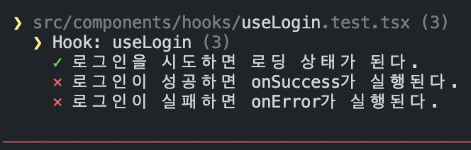
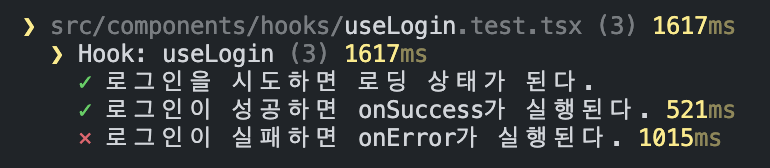
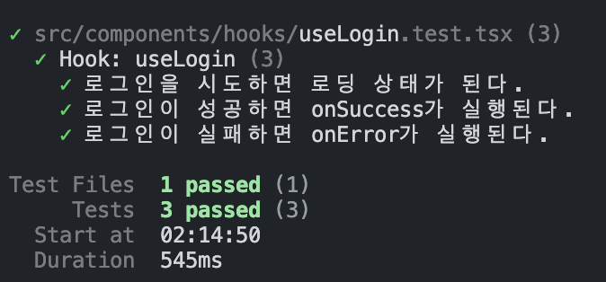
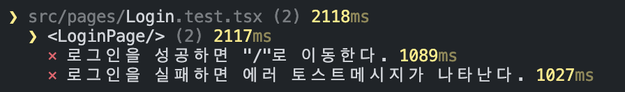
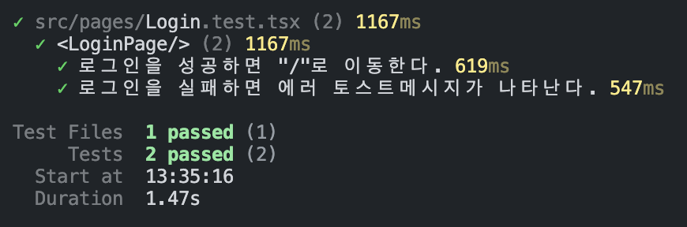

# LoginPage로 보는 React 통합테스트

## 들어가기 전에
이전 글에서는 LoginForm 컴포넌트에 대한 단위테스트(Unit test) 코드를 작성하면서 리팩토링까지 해보았습니다. 이번에는 여러 컴포넌트의 상호작용에 대한 통합테스트를 작성하겠습니다.

:::info
단위테스트에 대한 내용은 아래 링크를 통해서 확인하실 수 있으며, 이 글을 이해하는데에도 도움이 됩니다.  
[단위테스트](../unit-test/index.mdx)
:::

### 선수지식
이 글에서는 사용되는 기술에 대한 상세한 사용법은 설명하지 않습니다.
- React
- React-toastify
- React Router, TanStack Query
- Vitest, testing-library, msw
- Vite

---

## 통합테스트란?
이름 그대로 통합적으로 테스트하는 개념의 테스트입니다. 이전 글에서는 LoginForm 컴포넌트에 대해 한정적으로 테스트를 구현하였었는데요. 그러한 작은 단위를 테스트하는 것을 단위테스트(Unit test)라고 합니다. 반면에 **통합테스트(Integration test)는 여러 작은 컴포넌트로 구성된 큰 컴포넌트나 페이지 같이 통합된 형태를 테스트하는 것을 목적**으로 합니다. 통합테스트의 주요 목표는 두 가지로 분류해 볼 수 있습니다.

- 서버와의 통신에 대한 테스트
- 컴포넌트 간의 상호작용에 대한 테스트

그래서 이번에는 서버와의 통신에 대한 테스트로 `useLogin` 커스텀훅을 테스트해보고 마지막으로 `LoginForm`과 `useLogin` 등 컴포넌트와 훅 등이 상호작용하는 `LoginPage`에 대한 테스트를 진행하겠습니다. 테스트를 진행하면서 발생하는 트러블들을 해결하는 과정을 통해 msw 사용법에 대해서도 익히실 수 있습니다.

<!--truncate-->
---

## useLogin
`LoginForm` 안에 구현되어 있던 로그인 기능과 관련된 로직을 `useLogin` 훅으로 분리하도록 리팩토링 했었습니다. TanStack Query의 `useMutation`을 활용하여 `useLogin` 훅을 다음과 같이 작성하였습니다.

```tsx
// Login API 호출 함수
export const login = async (payload: LoginInfo) => {
  const response = await axios.post<Token>('/users/login', payload)
  return response.data
}
```
```tsx title="useLogin.ts"
import { useMutation } from '@tanstack/react-query'
import { LoginInfo, login } from '../../api'
import { Token } from '../../@types'

interface useLoginParams {
  onSuccess: (tokens: Token, variables: LoginInfo, context: unknown) => void
  onError: (errors: unknown, variables: LoginInfo, context: unknown) => void
}

const useLogin = ({ onSuccess, onError }: useLoginParams) => {
  return useMutation({
      mutationFn: (loginInfo: LoginInfo) => login(loginInfo),
      onSuccess,
      onError,
  })
}

export default useLogin
```

이제부터 작성된 `useLogin`이 제대로 작동하는지 통합테스트를 작성하겠습니다. login API를 호출하는 로직이 포함되어 **서버와의 통신을 테스트**해야 합니다.
 
테스트 케이스 작성은 간단합니다. `useLogin`이 해야하는 역할에 대해서 정리하면 다음과 같습니다.

1. 로그인 API를 호출한다.
2. 로그인 진행중에 대해 처리한다.
3. 로그인 성공에 대해 처리한다.
4. 로그인 실패에 대해 처리한다.

```tsx
describe('Hook: useLogin', () => {
  it('로그인을 시도하면 로딩 상태가 된다.', () => {

  })
  
  it('로그인이 성공하면 onSuccess가 실행된다.', () => {

  })

  it('로그인이 실패하면 onError가 실행된다.', () => {

  })
})
```

---


## 테스트용 Render 함수
각 테스트케이스마다 사용할 공통 Render함수를 먼저 정의하겠습니다. `useLogin` 로직에 따라 다음 사항을 고려하여 렌더 함수를 정의해야합니다.

- Hook 전용으로 테스트하는 `renderHook`을 사용하기
- `useMutation`을 위해 `QueryClientProvider`로 감싸기
- `useMutation`에 등록할 success, error side effect는 mocking 하기

```tsx
// Tanstack Query 사용을 위해 필요합니다.
export const hookWrapper = ({ children }: { children: ReactNode }) => (
  <QueryClientProvider
    client={
      new QueryClient({
        defaultOptions: { queries: { retry: false } },
        logger: {
          log: console.log,
          warn: console.warn,
          // ✅ no more errors on the console for tests
          error: () => {},
        },
      })
    }
  >
    {children}
  </QueryClientProvider>
)
```
```tsx
const renderUseLogin = () => {
  const onSuccess = vi.fn()
  const onError = vi.fn()

  const hookResult = renderHook(
    () => useLogin({ onSuccess, onError }),
    { wrapper: hookWrapper },
  )

  return {
    ...hookResult,
    onSuccess,
    onError,
  }
}
```

---

## 실패하는 테스트 코드
공통 Render 함수를 사용하여 각 케이스마다 테스트 코드를 아래와 같이 작성하고 테스트를 실행하겠습니다.

```tsx
describe('Hook: useLogin', () => {
  it('로그인을 시도하면 로딩 상태가 된다.', async () => {
    const { result } = renderUseLogin()

    act(() => {
      result.current.mutate({
        userAccount: 'test',
        userPW: '1234',
      })
    })

    await waitFor(() => {
      expect(result.current.isLoading).toBe(true)
    })
  })

  it('로그인이 성공하면 onSuccess가 실행된다.', async () => {
      const { result, onSuccess } = renderUseLogin()

      const loginInfo = {
        userAccount: 'test',
        userPW: '1234',
      }

      act(() => {
        result.current.mutate(loginInfo)
      })

      await waitFor(() => {
        expect(onSuccess).toHaveBeenCalledWith(
          ...[result.current.data, loginInfo, undefined],
        )
      })
  })

  it('로그인이 실패하면 onError가 실행된다.', async () => {
      const { result, onError } = renderUseLogin()

      const loginInfo = {
        userAccount: 'test',
        userPW: '1234',
      }

      act(() => {
        result.current.mutate(loginInfo)
      })

      await waitFor(() => {
        expect(onError).toHaveBeenCalledWith(
          ...[result.current.error, loginInfo, undefined],
        )
      })
  })
})
```

테스트 결과 역시 실패합니다.



그러나 로딩 상태에 대해서는 성공을 했는데 왜 그럴까요? 현재로는 `useLogin`에서 실제 서버의 login API를 호출하여 테스트 하고 있기 때문입니다.
이렇게 실서버와의 통신으로 테스트 하는 과정은 E2E(End to End test) 단계에서 진행하기 때문에 통합테스트 단계에는 올바른 방법의 테스트가 아닙니다. 따라서 저희는 **login API를 Mocking** 해야하겠습니다.

---

## MSW: REST API Mock
MSW(Mock Service Worker)는 API의 호출을 Intercept하고 응답을 원하는대로 Mocking 할 수 있는 방법을 제공합니다. [공식문서](https://mswjs.io/)를 통해서 자세한 사용법을 참조하시면 좋습니다.

### 1. Login API Mocking
실제 API의 응답처럼 약간의 지연을 주는 상황에서 성공과 실패 함수를 만들고, 성공함수는 handlers에 추가합니다.

```tsx
import { delay, http, HttpResponse } from 'msw'

const url = (path: string) => import.meta.env.VITE_API_URL + path

export const mockLogin = {
  // 로그인 성공
  success: http.post(url('/users/login'), async () => {
    await delay(500)

    return HttpResponse.json(
      {
        accessToken: 'accessToken',
        refreshToken: 'refreshToken',
      },
      { status: 201 },
    )
  }),

  // 로그인 실패
  fail: http.post(url('/users/login'), async () => {
    await delay(500)

    return HttpResponse.json(
      { message: 'failed to login' },
      { status: 401 },
    )
  }),
}

export const handlers = [mockLogin.success]
```

### 2. Mock Server
msw 서버를 셋팅합니다.
```ts title="server.ts"
import { setupServer } from 'msw/node'
import { handlers } from './handlers'

export const server = setupServer(...handlers)
```

### 3. setup
전체 테스트를 시작하기 전에 서버를 실행하고, 각 케이스마다 초기화하고, 종료시 서버를 종료하도록 테스트 setup에 설정합니다.
```ts
import '@testing-library/jest-dom'
import { server } from './mocks/server'
import { cleanup } from '@testing-library/react'

// onUnhandledRequest를 'bypass'로 설정하면
// handler에 등록되지 않은 url 호출에 대한 로그를 보여주지 않습니다.
beforeAll(() => server.listen({ onUnhandledRequest: 'bypass' }))

afterEach(() => {
  cleanup()
  server.resetHandlers()
})

afterAll(() => server.close())
```

---

## 성공하는 테스트 코드
msw 셋팅을 마쳤으니 다시 테스트를 실행하겠습니다.



이번에는 로그인 실패에 대한 케이스만 FAIL이 났고 나머지는 PASS하였습니다. 왜냐하면 msw mock server에 셋팅된 handlers 안에는 "성공"하는 mock API만 추가되었기 때문입니다. 따라서 로그린 실패 케이스에서만 서버가 실패하는 응답을 보내줄 수 있도록 추가적인 설정이 필요합니다.

### msw의 server.use
```tsx
describe('Hook: useLogin', () => {
  //...

  it('로그인이 실패하면 onError가 실행된다.', async () => {
    // 미리 정의해둔 실패 핸들러를 등록합니다.
    server.use(mockLogin.fail)

    const { result, onError } = renderUseLogin()

    const loginInfo = {
      userAccount: 'test',
      userPW: '1234',
    }

    act(() => {
      result.current.mutate(loginInfo)
    })

    await waitFor(() => {
      expect(onError).toHaveBeenCalledWith(
        ...[result.current.error, loginInfo, undefined],
      )
    })
  })
})
```

이제 모든 설정은 끝났습니다. 테스트를 실행하면 드디어 All Pass를 받을 수 있습니다.
이로서 `useLogin`의 통합테스트 작성은 완료하였습니다.



---

## LoginPage 테스트
마지막으로 `LoginForm`에 사용자 정보를 입력하고, `useLogin`의 기능을 사용하여 로그인이 처리되는 LoginPage에 대한 테스트를 진행하겠습니다.  테스트케이스는 매우 간단합니다.

```tsx
describe('<LoginPage/>', () => {
  it('로그인을 성공하면 "/"로 이동한다.', () => {
  
  })

  it('로그인을 실패하면 에러 토스트메시지가 나타난다.', () => {
  
  })
})
```

## 테스트용 Render 함수
여기에서도 케이스마다 공통으로 사용할 Render함수부터 정의하겠습니다. 다음 사항에 대해서 고려하세요.

- 페이지 라우팅은 React Router로 하고 있습니다. 따라서 테스트시에는 `createMemoryRouter`로 Routes를 정의해두어야 합니다.
- login API를 TanStack Query의 `useMutation`로 호출하고 있기 때문에 `QueryClientProvider`로 컴포넌트를 랩핑 해야합니다.

```tsx
export const routerRender = (path?: string[]) => {
  const memoryRouter = createMemoryRouter(
    [
      {
        path: '/login',
        element: <LoginPage />,
      },
      {
        path: '/',
        element: <HomePage />,
      },
    ],
    { initialEntries: path },
  )

  const renderResult = render(
    <QueryClientProvider client={new QueryClient()}>
      <ThemeProvider theme={dark}>
        <Global styles={GlobalStyle(dark)} />
        <RouterProvider router={memoryRouter} />

        <ToastContainer />
      </ThemeProvider>
    </QueryClientProvider>,
  )

  return {
    memoryRouter,
    ...renderResult,
  }
}
```

위에서 작성한 `routerRender`를 사용해 `renderLoginPage` 렌더 함수를 작성합니다.

```tsx title="LoginPage.test.tsx"
import { fireEvent, waitFor } from '@testing-library/react'
import { routerRender } from '../__tests__/utils'
import { expect } from 'vitest'
import { server } from '../__tests__/mocks/server'
import { mockLogin } from '../__tests__/mocks/handlers'

const renderLoginPage = () => {
  const { getByPlaceholderText, getByRole, findByText, memoryRouter } =
      routerRender(['/login'])

  const accountInput = getByPlaceholderText('아이디')
  const passwordInput = getByPlaceholderText('비밀번호')
  const loginButton = getByRole('button')

  const changeAccount = (value?: string) => {
    fireEvent.change(accountInput, { target: { value } })
  }

  const changePassword = (value?: string) => {
    fireEvent.change(passwordInput, { target: { value } })
  }

  const login = () => {
    fireEvent.click(loginButton)
  }

  return {
    accountInput,
    passwordInput,
    loginButton,
    changeAccount,
    changePassword,
    login,
    findByText,
    memoryRouter,
  }
}
```

### 실패하는 테스트 코드
앞서 작성한 테스트케이스에 대한 테스트 코드를 작성합니다.

- 페이지의 현재 경로를 체크하기 위해서 공통 렌더함수에서 전달하고 있는 `memoryRouter`를 사용합니다.
- 에러메시지는 React-Toastify를 사용하였습니다.

```tsx
describe('<LoginPage/>', () => {
  it('로그인을 성공하면 "/"로 이동한다.', async () => {
    const { login, changeAccount, changePassword, memoryRouter } =
        renderLoginPage()

    changeAccount('test')
    changePassword('1234')
    login()

    await waitFor(() => {
        expect(memoryRouter.state.location.pathname).toEqual('/')
    })
  })

  it('로그인을 실패하면 에러 토스트메시지가 나타난다.', async () => {
    server.use(mockLogin.fail)

    const { login, changeAccount, changePassword, findByText } =
        renderLoginPage()

    changeAccount('test')
    changePassword('1234')
    login()

    expect(await findByText('failed to login')).toBeVisible()
  })
})
```

실패하는 테스트 코드 결과는 역시 실패입니다.




### 성공하는 테스트 코드
테스트를 PASS시키기 위해 `LoginPage`를 구현해보겠습니다. `LoginForm` 컴포넌트와 `useLogin` 훅을 사용하고 성공 실패에 맞는 사이드이펙트를 구현하겠습니다.

```tsx title="LoginPage.tsx"
export default function LoginPage() {
  const navigate = useNavigate()
  
  // useLogin hook 사용
  const { isLoading, mutate: login } = useLogin({
    onSuccess: (tokens) => {
      const cookies = new Cookies()

      cookies.set('accessToken', tokens.accessToken)
      cookies.set('refreshToken', tokens.refreshToken)

      navigate('/')
    },
    onError: (errors) => {
      let message = ''

      if (errors instanceof AxiosError) {
          message = errors.response?.data.message
      }

      toastError(message, { isKiosk: true })
    },
  })

  return (
    {/* 스타일은 Styled-Component를 사용하였습니다. */}
    <PageLayout>
      <LoginPageContainer>
        <h1>로그인 페이지</h1>

        <LoginForm onSubmit={login} isLoading={isLoading} />
      </LoginPageContainer>

      <Version>{import.meta.env.VITE_DEPLOY_VERSION}</Version>
    </PageLayout>
  )
}
```

다시 한번 테스트를 실행하면 성공하는 결과를 얻을 수 있습니다.



---

## 정리
`LoginForm`, `useLogin`, `LoginPage에` 대해 단위테스트, 통합테스트를 진행하면서 동시에 테스트 가능한 코드로 리팩토링도 함께 진행하였습니다. 이번 글의 핵심은 Server와의 HTTP 통신을 msw를 통해서 Mocking 해보는 것이였습니다. 컴포넌트와 페이지에 대한 테스트가 전체적으로 작성된 그림을 볼 수 있었는데요. 하지만 테스트는 모든 것을 해결해주지 않습니다. 새로운 버그가 발견되면 그에 맞는 테스트 또한 함께 추가되거나 기존의 테스트를 보완하는 과정을 계속해서 거쳐야 할 것 입니다.