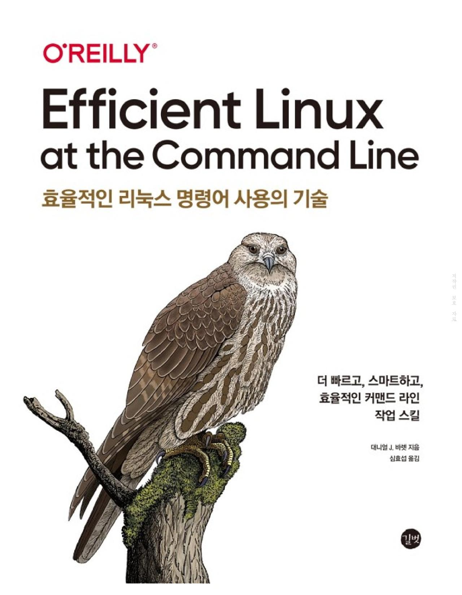

# [책리뷰] 효율적인 리눅스 명령어 사용의 기술
비전공, 독학개발로 시작하여 2년까지는 프론트엔드 개발자로서 리눅스 커맨드라인에 대한 지식 하나 없이도 큰 문제가 없이 주니어개발자 생활을 해왔다고 생각했었습니다. 어언 3년차로 접어들고 있는 지금 devServer, 빌드, CI/CD 등 상세히 조작하고 알아가야하는 영역이 넓어지면서, 셸, 커맨드라인에 대한 이해가 필요해지고 있다고 느끼고 있었습니다.

때마침 운좋게도 책 리뷰어로 선정되어 리눅스 커맨드라인에 대한 책 리뷰를 하게 되는 기회를 얻어 이 글을 작성하게 되었습니다.

---

  

- 제목: **Efficient Linux at the Command Line** 효율적인 리눅스 명령어 사용의 기술
- 저자: 대니얼 J. 바렛
- 옮긴이: 심효섭
- 출판사: 길벗

---

이 책은 리눅스 커맨드라인 활용서로 자주쓰고 유용한 커맨드라인에 대한 예시와 함께 작동방식을 차근차근 따라갈 수 있도록 작성되어 있습니다. 책의 분량 또한 많지 않아 기본적인 지식이 있는 상태라면, 한번 쭉 보셔도 오랜 시간이 걸리지 않으면서 익힐 수 있습니다. 시간이 많지 않다면, 목차를 참고하여 필요한 부분만 따라하셔도 빠르게 익히고 사용할 수 있게끔 활용방법을 잘 알려주고 줍니다.

사실 주로 브라우저와 함께 노는 프론트엔드 개발자에게는 (심지어 비전공이라 마주칠일이 없었다면) 대부분의 프로그램들이 GUI를 제공하고 있기 때문에 커맨드라인을 가지고 여러 실무적인 일을 접할 때가 많지는 않습니다. 그러나 연차가 쌓이고, 프로젝트를 직접 빌드하고 배포하는 것에 관여를 하기 시작하면서부터 서버, OS에 대한 이해를 조금씩 더 필요로 하게 되며 자연스럽게 셸과 커맨드라인을 만지작 거리게 될 수 밖에 없는데요.

프론트엔드 개발자 입장에서 배운다고 해도 실제로 많이는 쓰지 않기 때문에 무엇을 익혀서 쓸지 애매한 부분이 많습니다. 사실 이 책의 활용부분에서도 적극적으로 사용될 부분으로 보이진 않습니다. (현재의 제 기술수준으로 봤을 떄는요.)

따라서 '효율적인 리눅스 명령어의 사용의 기술' 책을 프론트엔드 개발자 입장에서 더 효율적으로 익히고 학습하는 방법을 공유해드리고자 합니다.

## 이 책을 효율적으로 읽는 법
읽는 법이라고는 했지만, 실용서이기 때문에 읽기만 하면 의미는 없습니다. 책을 펴고 컴퓨터도 킨 다음 셸 하나를 띄워놓고 시작하는게 좋습니다.

이 책의 서두에서는 이 책은 기본서가 아니니 기본에 대한 별도의 서적을 추천도 해줍니다. 그러나 바쁜 현대인인 저희에게는 여러 책을 섭렵하여 다시 돌아오는 것은 어려운 선택인 것 같습니다.

따라서 커맨드라인의 기초지식이 아예 없다면, *1부 핵심 개념*을 반드시 생략없이 학습하는 것을 추천합니다. 그리고 다음의 방법으로 책을 독파해보세요.
1. 개념에 대한 설명이 간략하게 매 장마다 되어 있습니다. 꼭 읽어주세요.
2. 셸에 커맨드를 작성하면서 동작하는 모습을 확인하세요.
3. 책에 설명이 없거나 모르는 부분은 구글링하거나, GPT를 통해서 빠르게 답변을 얻으세요.

리눅스 커맨드라인에 지식이 전무했던 제 입장에서 어디서부터 시작해서 어디까지 공부해야할지 모를 때, 이 책에 나와 있는 1부의 커맨드라인만 익혔는데도, 충분히 제 Mac 컴퓨터 위에서 효율적인 작업이 가능했습니다.

특히 이전에는 알아들을 수 없었던 CI/CD의 명령어들과 셸 위에 나타나는 로그들을 조금더 친숙하게 해석할 수 있다는 점에서 책을 읽고 있을 때보다 읽은 후에 더 가치를 느낄 수 있었습니다.

## 정리
이 책은 활용서로 나왔지만, 커맨드라인에 대한 필요성을 아직 느끼지 못했거나 필요하지만 방향을 잡지 못할 때 1부의 내용을 위에 추천한 방법으로 독파하면서 빠르게 커맨드라인에 대한 지식을 쌓을 수 있는 기본서로도 활용할 수 있다고 생각합니다.

1부의 내용을 익히고 커맨드라인에 대한 기본이 쌓였다면, **2부에서는 특히 6장 부모 프로세스와 자식 프로세스, 그리고 환경** 부분 *7장 명령을 실행하는 열한 한지 방법* 이 두개까지 읽어야 기본이 더 탄탄하다고 느껴집니다.

적당히 기능 구현에 대해 큰 문제를 느끼지 않고, 다음 단계로 나아가야 하는 프론트엔드 개발자분들께 빌드와 배포에 대해 접근하시면서 커맨드라인에 대해서도 이 책을 통해 익혀보시는 것을 추천드립니다.