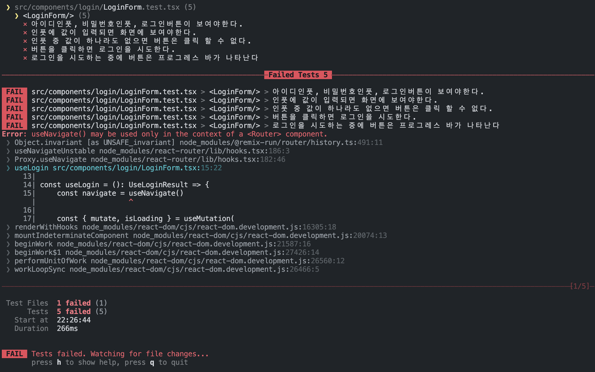
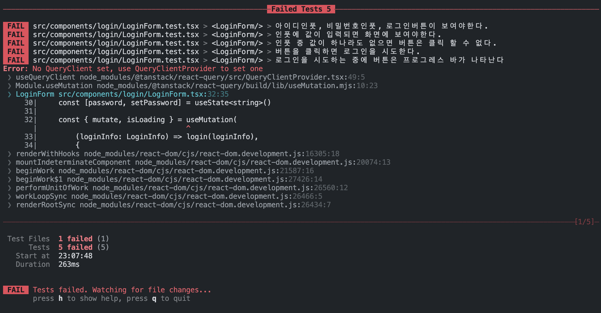
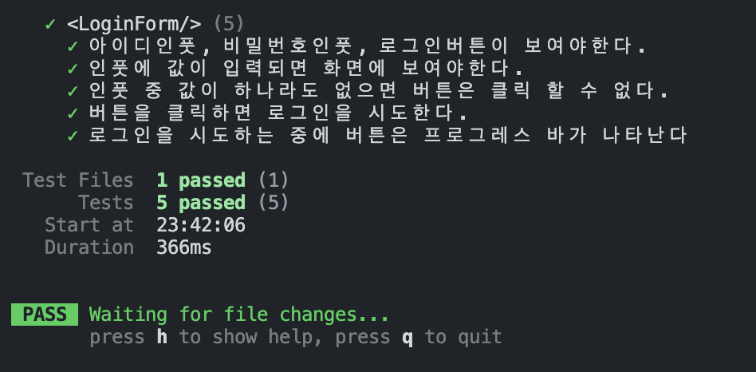

# LoginForm으로 보는 React 단위테스트와 리팩토링

## 들어가기 전에
늘어가는 기능과 화면에 비례해서 버그 또한 늘어나기 마련입니다. 그런데 그 버그를 수정하면 또 다른 곳이 터져버리는 불상사가 눈앞에 펼쳐지게 됩니다. 사람은 실수를 하기 마련이고 그것을 줄이기 위해서는 더 많은 시간을 쏟아야 합니다. 이러한 이유 때문이더라도 테스트코드는 결국 필요하게 됩니다.

따라서 이 글에서는 React로 작성된 `<LoginForm />` 컴포넌트에 대해 단위테스트를 작성하고, 그 과정에서 기존 코드의 문제점을 분석하고 테스트 가능한 코드로 리팩토링 하겠습니다.

<!--truncate-->

### 선수지식
이 글에서는 사용되는 기술에 대한 상세한 사용법은 설명하지 않습니다.
- React
- React Router, TanStack Query
- Vitest, testing-library
- Vite

### 테스트를 위한 기본셋팅
1. 테스트를 위한 패키지 다운로드

```
npm install -D vitest jsdom @testing-library/react @testing-library/jest-dom
```

2. 폴더 및 파일구조
"__test__" 폴더 안에는 테스트를 위한 mocks, utils, setup 등을 가지고 있으며 실제 테스트를 하는 코드들은 "components" 내부에 테스트를 해야하는 곳과 가깝게 배치합니다.

```
src
├──── __test__
│  ├───── mocks.ts
│  ├───── setup.ts
│  └───── utils.tsx
└──── components
   └───── login
      ├───── LoginForm.tsx
      └───── LoginForm.test.tsx

```


3. setup.ts
setup파일에 import 해두면 모든 테스트 파일안에서 Dom 테스트를 위한 추가적인 jest의 matcher를 사용할 수 있습니다. (여기에서는 vitest)

```js
import '@testing-library/jest-dom'
```

4. vite.config.ts에 test config 추가
```ts
/// <reference types="vitest" />
import { defineConfig } from 'vite'
import react from '@vitejs/plugin-react-swc'

export default defineConfig({
  plugins: [react()],
  test: {
    setupFiles: ['./src/__tests__/setup.ts'],
    globals: true,
    environment: 'jsdom',
  },
})
```

---

## 테스트 케이스 구성
본격적으로 테스트를 시작하면서 바로 머리속에 생각이 하나 떠올랐을 겁니다. "무엇을 어디까지 테스트를 해야하는걸까?"
정답은 없지만, React Testing Library 공식문서의 가이드 원칙에 따르면 생각의 범위를 좁혀갈 수 있습니다.

> 테스트가 소프트웨어가 사용되는 방식과 닮을 수록, 테스트는 더 많은 확신을 준다.

다시 말하면, 사용자가 앱에서 보고 만지고 하는 행위들 자체를 테스트 해야한다는 것입니다.

`LoginForm.tsx` 파일이 있는 같은 폴더에 `LoginForm.test.tsx` 파일을 생성하겠습니다. 그리고 위 기본 원칙을 고려하여 LoginForm의 테스트 케이스를 구성하겠습니다.

```tsx
describe('<LoginForm/>', () => {
  it('아이디인풋, 비밀번호인풋, 로그인버튼이 보여야한다.', () => {

  })

  it('인풋에 값이 입력되면 화면에 보여야한다.', () => {

  })

  it('인풋 중 값이 하나라도 없으면 버튼은 클릭 할 수 없다.', () => {

  })

  it('버튼을 클릭하면 로그인을 시도한다.', () => {

  })

  it('로그인을 시도하는 중에 버튼은 프로그레스 바가 나타난다', () => {

  })
})
```

*마지막 테스트 케이스에서는 내부적인 기획에 따라 버튼에 프로그레스가 나타나야 하는 상황입니다. 일반적으로는 다르게 로딩이 처리 될 수 있습니다.*

---

## 테스트 코드 작성
각 테스트는 `LoginForm`을 렌더링한 후 각 요소가 있는지, 사용자 이벤트에 반응을 하는지 등을 테스트 하게 될 것입니다.

1. `LoginForm` 렌더링하고 자주 사용하는 함수와 요소를 반환하는 함수를 만듭니다.

```tsx
/**
 * 각 테스트케이스에서 사용할 컴포넌트 렌더 함수
 */
const componentRender = ({ isLoading }: { isLoading: boolean }) => {
  // 로그인을 위한 함수를 모킹합니다.
  const onSubmit = vi.fn()

  const { getByPlaceholderText, getByRole } = render(
    <LoginForm isLoading={isLoading} onSubmit={onSubmit}/>,
  )

  const accountInput = getByPlaceholderText('아이디') as HTMLInputElement
  const passwordInput = getByPlaceholderText('비밀번호') as HTMLInputElement
  const loginButton = getByRole('button') as HTMLButtonElement
  const loginForm = getByRole('form') as HTMLFormElement

  const changeAccount = (value?: string) => {
    fireEvent.change(accountInput, { target: { value } })
  }

  const changePassword = (value?: string) => {
    fireEvent.change(passwordInput, { target: { value } })
  }

  return {
    onSubmit,
    getByRole,
    accountInput,
    passwordInput,
    loginButton,
    loginForm,
    changeAccount,
    changePassword,
  }
}
```
<br/>

2. 각 케이스별로 테스트 코드를 작성합니다.

```tsx
describe('<LoginForm/>', () => {
  it('아이디인풋, 비밀번호인풋, 로그인버튼이 보여야한다.', () => {
    const { accountInput, passwordInput, loginButton } = componentRender()

    expect(accountInput).toBeInTheDocument()
    expect(passwordInput).toBeInTheDocument()
    expect(loginButton).toBeInTheDocument()
  })

  it('인풋에 값이 입력되면 화면에 보여야한다.', () => {
    const { accountInput, passwordInput, changeAccount, changePassword } = componentRender()

    changeAccount('testAccount')
    changePassword('1234')

    expect(accountInput.value).toBe('testAccount')
    expect(passwordInput.value).toBe('1234')
  })

  it('인풋 중 값이 하나라도 없으면 버튼은 클릭 할 수 없다.', () => {
      const { loginButton, changeAccount, changePassword, onSubmit } = componentRender()

      changeAccount()
      changePassword('1234')
      fireEvent.click(loginButton)
      expect(onSubmit).toBeCalledTimes(0)

      changeAccount('test')
      changePassword('')
      fireEvent.click(loginButton)
      expect(onSubmit).toBeCalledTimes(0)

      changeAccount()
      changePassword()
      fireEvent.click(loginButton)
      expect(onSubmit).toBeCalledTimes(0)

      changeAccount('test')
      changePassword('1234')
      fireEvent.click(loginButton)
      expect(onSubmit).toBeCalledTimes(1)
  })

  it('버튼을 클릭하면 로그인을 시도한다.', () => {
      const { loginButton, onSubmit, changeAccount, changePassword } = componentRender()

      changeAccount('test')
      changePassword('1234')

      fireEvent.click(loginButton)

      expect(onSubmit).toBeCalledTimes(1)
      expect(onSubmit).toHaveBeenCalledWith({
        userAccount: 'test',
        userPW: '1234',
      } as LoginInfo)
  })

  it('로그인 시도하는 중에 버튼은 프로그레스 바가 나타난다', () => {
      const { getByRole } = componentRender({
        isLoading: true,
      })

      const buttonProgress = getByRole('progressbar')

      expect(buttonProgress).toBeVisible()
  })
})
```
<br/>

3. 작성된 테스트를 실행합니다.



`LoginForm.tsx` 컴포넌트가 어떻게 구현되어 있는지도 모른채로 테스트케이스를 작성했습니다. 결과는 당연히 FAIL이 날 수밖에 없겠죠. 이제부터 테스트를 PASS 할 수 있도록 리팩토링을 진행하겠습니다.

---

## 테스트를 PASS 하도록 리팩토링 하기
위 사진을 보면 "useNavigate() may be used only..."라는 에러가 발생하며 테스트가 실패하였습니다. 해당 에러는 `React Router`와 관련되어 있으며 `LoginForm` 렌더링 자체에서 실패했음을 알 수 있습니다. 이제 작성되어 있던 `LoginForm.tsx` 코드를 먼저 살펴보겠습니다.

```tsx title="LoginForm.tsx"
import { Button, Input, toastError } from '내부디자인시스템'
import { FormEventHandler, useState } from 'react'
import { LoginInfo, login } from '../../api'
import { useMutation } from '@tanstack/react-query'
import { Cookies } from 'react-cookie'
import { AxiosError } from 'axios'
import { useNavigate } from 'react-router-dom'

export default function LoginForm() {
  const [account, setAccount] = useState<string>()
  const [password, setPassword] = useState<string>()

  const navigate = useNavigate()
  
  const { mutate, isLoading } = useMutation(
    (loginInfo: LoginInfo) => login(loginInfo),
    {
      onSuccess(tokens) {
        const cookies = new Cookies()

        cookies.set('accessToken', tokens.accessToken)
        cookies.set('refreshToken', tokens.refreshToken)

        navigate('/')
      },
      onError(errors) {
        if (errors instanceof AxiosError) {
            toastError(errors.response?.data.message)
        }
      },
    }
  )

  const handleSubmit: FormEventHandler<HTMLFormElement> = (e) => {
      e.preventDefault()

      mutate({
          userAccount: account,
          userPW: password,
      })
  }

  return (
    <form onSubmit={handleSubmit} role='form'>
      <Input
        defaultValue={account}
        placeholder='아이디'
        onChange={(e) => setAccount(e.currentTarget.value)}
      />
      <Input
        type='password'
        defaultValue={password}
        placeholder='비밀번호'
        onChange={(e) => setPassword(e.currentTarget.value)}
      />
      <Button
        role='button'
        type='submit'
        disabled={!(account && password) ? true : false}
        isLoading={isLoading}
      >
        로그인
      </Button>
    </form>
  )
}
```

에러가 발생했던 `useNavigate`는 login 시도의 성공 후 페이지를 "/"로 이동시키기 위해 사용된 `React Router`의 Hook 입니다.

그런데 `LoginForm`에 한정에서 생각했을 때에는 로그인 성공 후 페이지 이동이나, 실패 후 에러 토스트메시지를 띄우는 행위들은 `LoginForm`의 관심사가 아닙니다. 물론 테스트케이스에서도 그런 행위에 대한 테스트는 없습니다.

따라서 `LoginForm` 안에서 로그인 실행 이후에 벌어지는 일들에 대해서는 관심사를 분리하도록 리팩토링 하겠습니다. 먼저 성공과 실패에 대한 `useMutation`의 side effect를 `LoginFormProp`로 넘겨받는 방법으로 고치겠습니다.

```tsx title="LoginForm.tsx"

// ...

interface LoginFormProps {
  onSuccess: (tokens: Token) => void
  onError: (error: unknown) => void
}

export default function LoginForm({ onSuccess, onError }: LoginFormProps) {
  const [account, setAccount] = useState<string>()
  const [password, setPassword] = useState<string>()

  const { mutate, isLoading } = useMutation(
    (loginInfo: LoginInfo) => login(loginInfo),
    {
      onSuccess,
      onError,
    }
  )

  const handleSubmit: FormEventHandler<HTMLFormElement> = (e) => {
    e.preventDefault()

    mutate({
      userAccount: account,
      userPW: password,
    })
  }

  // ...
}
```

위 코드로 다시 한번 테스트를 실행하겠습니다.



이번에는 "No QueryClient set, ..."이라는 `TanStack Query` 관련 에러가 발생해서 렌더링에 실패합니다. `testing-library`의 `render` 함수를 `QueryClientProvider로` wrapping 하지 않아서 발생하는 에러입니다. 

그러나 다음의 이유로 저희는 `useMutation`을 `LoginForm` 내부에서 분리시키는 것으로 추가 리팩토링을 하겠습니다. 
1. `useMutation`의 `mutationFn`인 `login`은 서버와 통신하는 API 함수로 해당 기능의 테스트는 `LoginForm`의 관심사가 아닙니다.
2. `useLogin`이라는 Custom Hook으로 분리하면 login 기능의 재사용성을 높일 수 있습니다.

최종적으로 `useMutation으로` 받던 isLoading과 mutate(login API 함수)를 `LoginFormProps`로 전달받도록 리팩토링 하겠습니다.

```tsx
import { Button, Input } from '내부디자인시스템'
import styled from '@emotion/styled'
import { FormEventHandler, useState } from 'react'
import { LoginInfo } from '../../api'

export interface LoginFormProps {
  onSubmit: (loginInfo: LoginInfo) => void
  isLoading?: boolean
}

export default function LoginForm({ onSubmit, isLoading }: LoginFormProps) {
  const [account, setAccount] = useState<string>()
  const [password, setPassword] = useState<string>()

  const handleSubmit: FormEventHandler<HTMLFormElement> = (e) => {
    e.preventDefault()

    onSubmit({
      userAccount: account,
      userPW: password,
    })
  }

  return (
    <form onSubmit={handleSubmit} role='form'>
      <Input
          defaultValue={account}
          placeholder='아이디'
          onChange={(e) => setAccount(e.currentTarget.value)}
      />
      <Input
          type='password'
          defaultValue={password}
          placeholder='비밀번호'
          onChange={(e) => setPassword(e.currentTarget.value)}
      />
      <Button
          role='button'
          type='submit'
          disabled={!(account && password) ? true : false}
          isLoading={isLoading}
      >
          로그인
      </Button>
    </form>
  )
}
```

리팩토링을 완료 후에 테스트를 다시 실행해보면 드디어 성공하는 결과를 얻을 수 있습니다.



---

## 정리
기존의 `LoginForm` 컴포넌트는 TDD로 방식으로 작성된 코드는 아니였습니다. 이 글에서는 구현된 코드에 관계없이 테스트를 먼저 작성해봄으로써 TDD와 비슷한 방식으로 리팩토링을 접근하였습니다.

테스트를 먼저 작성하고, FAIL테스트를 PASS시키기 위한 과정 속에서 자연스럽게 기존 코드를 리팩토링 하게 되었는데요. 이에 따라 자연스럽게 해당 컴포넌트의 관심사와 재사용성 측면에 대해서 생각하게 되었습니다.

이런 측면에서는 테스트는 단순히 발생할 수 있는 버그를 쉽게 잡을 수 있는 것을 떠나서 클린한 코드를 작성할 수 있게 하는 접근방법임을 깨달을 수 있습니다.